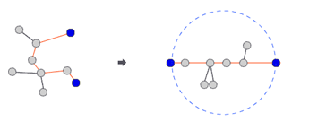
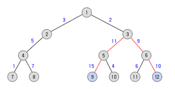

# [BOJ] 1967 - 트리의 지름 (Java)

## 🔗 문제 링크
[백준 1967: 트리의 지름](https://www.acmicpc.net/problem/1967)


---
## 📊 성능 분석 (Performance)

| 메모리 (Memory) | 시간 (Time) | 언어 (Language) | 코드 길이 (Code Length) |
| :---: | :---: | :---: | :---: |
| **22684 KB** | **260 ms** | **Java 11** | **1562 B** |


## 📌 문제 개요
<h2>문제</h2>
<hr>
<pre>
트리(tree)는 사이클이 없는 무방향 그래프이다. 트리에서는 어떤 두 노드를 선택해도 둘 사이에 경로가 항상 하나만 존재하게 된다. 트리에서 어떤 두 노드를 선택해서 양쪽으로 쫙 당길 때, 가장 길게 늘어나는 경우가 있을 것이다. 이럴 때 트리의 모든 노드들은 이 두 노드를 지름의 끝 점으로 하는 원 안에 들어가게 된다.
</pre>


<pre>
이런 두 노드 사이의 경로의 길이를 트리의 지름이라고 한다. 정확히 정의하자면 트리에 존재하는 모든 경로들 중에서 가장 긴 것의 길이를 말한다.

입력으로 루트가 있는 트리를 가중치가 있는 간선들로 줄 때, 트리의 지름을 구해서 출력하는 프로그램을 작성하시오. 아래와 같은 트리가 주어진다면 트리의 지름은 45가 된다.
</pre>


<p>트리의 노드는 1부터 n까지 번호가 매겨져 있다.</p>
<hr>
<h2>입력</h2>
<p>파일의 첫 번째 줄은 노드의 개수 n(1 ≤ n ≤ 10,000)이다. 둘째 줄부터 n-1개의 줄에 각 간선에 대한 정보가 들어온다. 간선에 대한 정보는 세 개의 정수로 이루어져 있다. 첫 번째 정수는 간선이 연결하는 두 노드 중 부모 노드의 번호를 나타내고, 두 번째 정수는 자식 노드를, 세 번째 정수는 간선의 가중치를 나타낸다. 간선에 대한 정보는 부모 노드의 번호가 작은 것이 먼저 입력되고, 부모 노드의 번호가 같으면 자식 노드의 번호가 작은 것이 먼저 입력된다. 루트 노드의 번호는 항상 1이라고 가정하며, 간선의 가중치는 100보다 크지 않은 양의 정수이다.</p>
<hr>
<h2>출력</h2>
<p>첫째 줄에 트리의 지름을 출력한다.</p>
<hr>

## 💡 해결 프로세스

 1. 가중치가 있는 그래프로 해석하여 다익스트라 방식으로 해결한다.
 2. 임의의 정점으로부터 가장 멀리 떨어진 노드를 구한다.
 3. 구한 노드로부터 가장 멀리 떨어진 노드 까지의 거리를 구한다.  
 
---

## 💻 코드 구조 상세 (Core Logic)


🔍 분할정복 구현 구현
```Java
    public static int[] dijik(int start) {
		PriorityQueue<int[]> pq = new PriorityQueue<>(
			    (a, b) ->a[0]- b[0]
			);
		int[] ret = new int[2];
		int[] dist = new int[n+1];
		Arrays.fill(dist,Integer.MAX_VALUE);
		dist[start]= 0 ; 
		pq.add(new int[] {0,start});
		while(!pq.isEmpty()) {
			int[] picked = pq.poll();
			int val = picked[0];
			int now = picked[1];
			if(dist[now]< val )continue;;
			if(dist[now] > ret[1] ) {
				ret[1]  =dist[now];
				ret[0] = now;
			}
			
			for(int i = 0;i <edges[now].size();++i) {
				int[]next = edges[now].get(i);
				int nxtNode=  next[1];
				int len = next[0];
				if(dist[nxtNode] <= val+len )continue;
				dist[nxtNode]  = val +len ; 
				pq.add(new int[] {dist[nxtNode], nxtNode});
			}
			
			
		}
		return ret ;
	}
    
```

🔍 세팅(사전 준비)
```Java
  public static void main(String[] args) throws Exception {
		StringTokenizer st ; 
		BufferedReader br = new BufferedReader(new InputStreamReader (System.in));
		
		n = Integer.parseInt( br.readLine());
		edges = new ArrayList [n+1];
		for(int i = 0 ;i< n+1;++i) edges[i]=new ArrayList();
		for(int i = 0 ;i< n-1;++i) {
			st= new StringTokenizer(br.readLine());
			int from = Integer.parseInt(st.nextToken());
			int to = Integer.parseInt(st.nextToken());
			int val = Integer.parseInt(st.nextToken());
			edges[from].add(new int[] {val, to});
			edges[to].add(new int[] {val, from});
		}
		int[] ret=  dijik(1);
		int ans = dijik(ret[0])[1];
		System.out.print(ans);
	}
```


---
⚠️ 주의 및 회고
생각해보니 트리여서 굳이((우선순위)큐로 거리 기록)다익스트라 방식을 안쓰고 dfs로 누적 기록하면서 구했어도 상관없었을 거 같다.    
