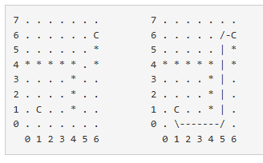

# [BOJ] 6087 - 레이저 통신 (Java)

## 🔗 문제 링크
[백준 6087: 레이저 통신](https://www.acmicpc.net/problem/6087)


---
## 📊 성능 분석 (Performance)

| 메모리 (Memory) | 시간 (Time) | 언어 (Language) | 코드 길이 (Code Length) |
| :---: | :---: | :---: | :---: |
| **17560 KB** | **212 ms** | **Java 11** | **11813091 B** |


## 📌 문제 개요
<h2>문제</h2>
<hr>
<pre>
크기가 1×1인 정사각형으로 나누어진 W×H 크기의 지도가 있다. 지도의 각 칸은 빈 칸이거나 벽이며, 두 칸은 'C'로 표시되어 있는 칸이다.

'C'로 표시되어 있는 두 칸을 레이저로 통신하기 위해서 설치해야 하는 거울 개수의 최솟값을 구하는 프로그램을 작성하시오. 레이저로 통신한다는 것은 두 칸을 레이저로 연결할 수 있음을 의미한다.

레이저는 C에서만 발사할 수 있고, 빈 칸에 거울('/', '\')을 설치해서 방향을 90도 회전시킬 수 있다.

아래 그림은 H = 8, W = 7인 경우이고, 빈 칸은 '.', 벽은 '*'로 나타냈다. 왼쪽은 초기 상태, 오른쪽은 최소 개수의 거울을 사용해서 두 'C'를 연결한 것이다.
</pre>




<hr>
<h2>입력</h2>
<pre>첫째 줄에 W와 H가 주어진다. (1 ≤ W, H ≤ 100)

둘째 줄부터 H개의 줄에 지도가 주어진다. 지도의 각 문자가 의미하는 것은 다음과 같다.
</pre>

<ul>
	<li>
		.: 빈 칸
	</li>
	<li>
		*: 벽
	</li>
	<li>
		C: 레이저로 연결해야 하는 칸
	</li>
</ul>

<p>'C'는 항상 두 개이고, 레이저로 연결할 수 있는 입력만 주어진다.</p>
<hr>
<h2>출력</h2>
<p>첫째 줄에 인범이가 깰 수 있는 계란의 최대 개수를 출력한다.</p>
<hr>

## 💡 해결 프로세스

 1. 재귀의 상태는 현재 위치 + 현재 위치에서의 방향으로 나타낸다. 사용한 거울의 개수로 나타낸다,
 2. 방문한 상태에 대한 중복을 제거하기 위해서 dp[R][C][DIR]=현재 상태에 도달하기위한 최소 거울의 개수로 지정한다. 
 3. 현재 상태보다 거울을 많이 사용한 경우는 사전에 가지치기한다.
 4. 목표에 도달한 경우 최솟값을 갱신한다.
---

## 💻 코드 구조 상세 (Core Logic)


🔍 백트래킹+ 메모이제이션
```Java
    public static void dfs(int r, int c, int numMirrors,int dir) {
		if(dir != -1) {
			if(memo[r][c][dir] <= numMirrors )return;
			memo[r][c][dir] = numMirrors;
			if(r==end[0] && c==end[1] ) {
				ans = Math.min( ans , numMirrors);
				return ;
			}
		}
		for(int i =0 ; i< 4 ;++i) {
			int nxtR = r+dr[i];
			int nxtC = c+dc[i];
			if(0> nxtR || nxtR >= R  || 0> nxtC || nxtC >= C)continue; 
			if(vis[nxtR ][nxtC]==true )continue ;
			if(map[nxtR ][nxtC]=='*')continue; 
			int extra = (dir==i || dir==-1 )?0:1;
			vis[nxtR][nxtC]=true;
			memo[r][c][i] =Math.min(memo[r][c][i],numMirrors + extra); 
			dfs(nxtR ,nxtC,memo[r][c][i]  ,i);
			vis[nxtR ][nxtC]=false;
		}
		
	}
```
🔍 세팅(사전 준비)
```Java
public class Main {
	static int[] start = new int[2];
	static int[] end = new int[2];
	static int C ; 
	static int R ;
	static char[][] map;
	static boolean[][] vis ; 
	static int []dr = {0,0,1,-1};
	static int []dc = {1,-1,0,0};
	static int ans = Integer.MAX_VALUE;
	static int[][][] memo; 
	public static void main(String[] args) throws Exception {
			BufferedReader br = new BufferedReader(new InputStreamReader(System.in));
			StringTokenizer st= new StringTokenizer( br.readLine());
			C = Integer.parseInt(st.nextToken());
			R = Integer.parseInt(st.nextToken());
			map = new char[R][C];
			vis  = new boolean [R][C];
			memo = new int [R][C][4];
			start[0]=-1;
			end[0]=-1;
			for(int r = 0 ;r<R;++r) {
				String line = br.readLine();
				for(int c = 0 ;c<C;++c) {
					Arrays.fill( memo[r][c],Integer.MAX_VALUE);
					map[r][c] = line.charAt(c); 
					if(map[r][c] != 'C')continue;
					if(start[0]==-1)
					{
						start[0]= r; start[1]=c;
					}
					else {
						end[0]= r; end[1]=c;
					}
					
				}
			}
			dfs(start[0],start[1],0,-1);
			System.out.print(ans+"");
			
			
		}
	}

```

⚠️ 주의 및 회고
마지막에 그리디하게 접근하는 것이 의미없다면 재귀를 막고 체크하는 방식이 좋다.    
