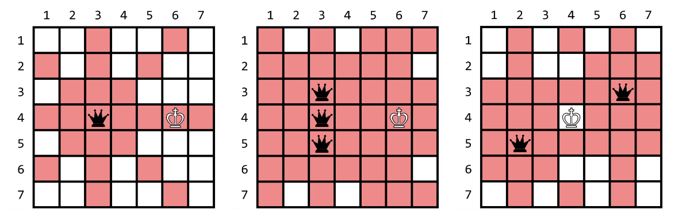

# [BOJ] 26006 - K-Queen (Java)

## 🔗 문제 링크

[백준 26006: K-Queen](https://www.acmicpc.net/problem/26006)

---

## 📊 성능 분석 (Performance)

| 메모리 (Memory) | 시간 (Time) | 언어 (Language) | 코드 길이 (Code Length) |
| :-------------: | :---------: | :-------------: | :---------------------: |
|  **47376 KB**   | **404 ms**  |   **Java 11**   |       **1669 B**        |

## 📌 문제 개요

<h2>문제</h2>
<hr>
<pre>
재헌이는 생일 선물로 크기가 
$N \times N$인 체스판과 백색 킹 하나, 흑색 퀸 
$100\ 000$개를 받았다. 킹은 8방향(상하좌우 및 대각선)으로 한 칸씩 이동할 수 있고, 퀸은 같은 행, 열, 대각선에 있는 상대 기물을 공격할 수 있다. 기물이 체스판 바깥으로 나갈 수는 없다.

체스판 위에 기물들을 이곳저곳 놓아 보던 재헌이는 다음과 같은 3가지 상태를 발견했다.

</pre>

<ol>
	<li>
		체크: 킹이 상대 기물에 의해 공격받고 있으면서, 킹을 한 번 움직여 상대의 공격으로부터 벗어날 수 있는 경우
	</li>
	<li>
		체크메이트: 킹이 상대 기물에 의해 공격받고 있으면서, 킹을 어떻게 한 번 움직이더라도 상대의 공격으로부터 벗어날 수 없는 경우
	</li>
	<li>
		스테일메이트: 킹이 공격받고 있지는 않지만, 킹을 어떻게 한 번 움직이더라도 상대 기물에 의해 공격을 받게 되는 경우
	</li>
<ol>
<pre>
아래 그림은 왼쪽부터 각각 체크, 체크메이트, 스테일메이트의 한 가지 예를 보여준다.
</pre>



<pre>
신이 난 재헌이는 체스판 위에 백색 킹 하나와 흑색 퀸 $K$개를 놓았는데, 이때 백색 킹과 8방향으로 인접한 칸에는 흑색 퀸을 놓지 않았다. 그러고는 이 체스판이 어느 상태에 해당하는지 여러분에게 물어보았다. 재헌이의 질문에 답해보자!
</pre>

<hr>
<h2>입력</h2>
 
<pre>
첫째 줄에 체스판의 크기 $N$과 흑색 퀸의 수  $K$가 주어진다. $(3 \le N \le 10^9, 1 \le K \le 100\ 000)$ 

다음 줄에 백색 킹의 위치 $R, C$가 주어진다. $R$행 $C$열에 백색 킹이 있음을 의미한다. $(1 \le R,C \le N)$ 

다음 $K$개의 줄에 걸쳐 각 흑색 퀸의 위치 $R_i, C_i$가 주어진다.
$i$번째 퀸이 $R_i$행 $C_i$열에 있음을 의미한다. $(1 \le R_i, C_i \le N)$ 
두 기물의 위치가 중복되는 경우는 없으며, 백색 킹과 8방향으로 인접한 칸에 흑색 퀸이 놓여있는 경우는 주어지지 않는다.

</pre>

<hr>
<h2>출력</h2>
<p>주어진 체스판의 상태가 체크이면 CHECK를, 체크메이트이면 CHECKMATE를, 스테일메이트이면 STALEMATE를, 3가지 상태 중 어느 것에도 속하지 않으면 NONE을 출력한다.</p>
<hr>

<hr>

## 💡 해결 프로세스

1. 기존의 N퀸 문제처럼 각 열,행, 대각선들을 배열로두고 접근하면 메모리 초과가 납니다.
2. king의 위치를 포함한 9개의 위치에 대해서 block된 영역인지 확인합니다.
3. block된 영역인지 확인하는 방법은 9개의 영역과 퀸의 행, 열, 열과 행의 합, 열과 행의 차 중 하나라도 같은 값이 있다면 block 체크하고 center 혹은 around에 ++합니다.
4. 모든 퀸에 대해서 블럭된 영역을 확인한 뒤에 킹이 어떤 상황에 있는지 판별합니다.

---

## 💻 코드 구조 상세 (Core Logic)

🔍 행 열 대각선 규칙 활용 -- 겹치는 영역 확인

```Java
	//queens
		int center =0;
		int around = 0;
		for(int i = 0 ; i<k;++i ) {
			st = new StringTokenizer(br.readLine());
			int r= Integer.parseInt(st.nextToken())-1;
			int c = Integer.parseInt(st.nextToken())-1;
			for(int d =0;d<9;++d) {
				if(blocked[d]==true)continue;
				int nr = king[0] +dr[d];
				int nc = king[1] +dc[d];
				if( nr < 0  || nr>=n  || nc<0 || nc>=n) {
					blocked[d]=true;
					around++;
					continue;
				}
				if( nr == r ||
				    nc == c ||
				   (c - r == nc - nr )||
				   (r + c == nr + nc)) {
					if( d==0)
						center++;
					else around++;
					blocked[d]=true;
				}
			}
		}
		String ans ="";
		if(center ==1 && around !=8 )ans ="CHECK";
		else if(center ==1 && around ==8 )ans ="CHECKMATE";
		else if(center ==0 && around ==8 )ans ="STALEMATE";
		else ans ="NONE";
		System.out.print(ans);
```

🔍 세팅

```Java
import java.util.*;
import java.io.*;

public class Main {


	static int[] dr = {0, -1,-1,0,1,1,1,0,-1};
	static int[] dc = {0, 0,1,1,1,0,-1,-1,-1};
	static boolean[] blocked = new boolean[9];
	static int n;
	static int k;
	static boolean check = false;
	static boolean checkMate = false;
	static boolean staleMate =false;
	static int[] king =new int[2];

	public static void main(String[] args) throws Exception {
		BufferedReader br = new BufferedReader(new InputStreamReader(System.in));
		StringTokenizer st;

		st = new StringTokenizer(br.readLine());
		n = Integer.parseInt(st.nextToken());
		k = Integer.parseInt(st.nextToken());

		st = new StringTokenizer(br.readLine());
		king[0] = Integer.parseInt(st.nextToken())-1;
		king[1] = Integer.parseInt(st.nextToken())-1;
	}
}
```

⚠️ 주의 및 회고
배열에 block 상태를 저장하는 것은 메모리 초과를 유발한다.
