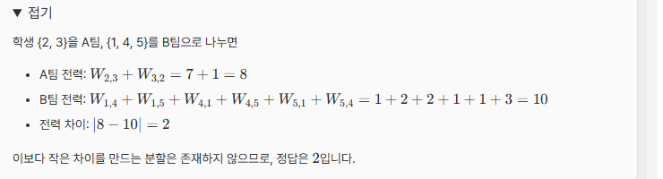
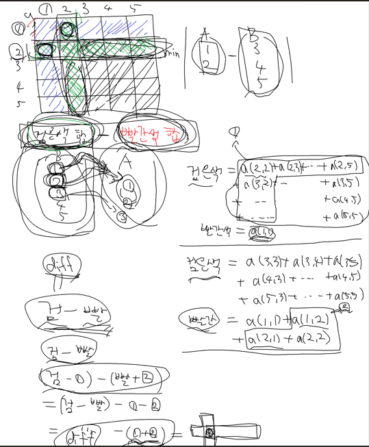

# [SourceTree] 1775 -공정한 팀나누기 (Java)

## 🔗 문제 링크
[SourceTree 1775번: 공정한 팀나누기](https://www.codetree.ai/ko/external-connection/classes/177/lectures/1775/problems/fair-team-split/description)


---
## 📊 성능 분석 (Performance)

| 메모리 (Memory) | 시간 (Time) | 언어 (Language) |
| :---: | :---: | :---: | :---: |
| **9 MB** | **85 ms** | **Java 11** |


## 📌 문제 개요
체육 시간에 N명의 학생을 두 팀으로 나누어 경기를 하려고 합니다. N명의 학생에게는 1번부터 N번까지의 고유한 번호가 부여되어 있습니다.
같은 팀이 된 학생들 사이에는 팀워크가 발생합니다. i번 학생이 j번 학생과 같은 팀이 되었을 때 발생하는 팀워크는 W[i][j] 입니다. 팀워크는 방향에 따라 다를 수 있으며, W[i][j] 와 W[j][i]가 서로 다를 수 있습니다.각 팀의 전력은 해당 팀에 속한 모든 학생 쌍 (i,j) (i=j)에서 발생하는 팀워크 W[i][j]의 합입니다.
두 팀의 인원이 꼭 같을 필요는 없지만, 공정한 경기를 위해 각 팀에는 최소 K명 이상의 학생이 있어야 합니다.
두 팀의 전력 차이의 절댓값이 최소가 되도록 팀을 나누었을 때, 그 최솟값을 구해 주세요.


---

## 💡 해결 프로세스
 1. 모든 선수가 한팀에 속해있다고 가정하여 전체 합을 구해놓고 lv 번째 선수를 다른 팀으로 뻅니다.
 2. 2명 이상의 플레이어가 빠지는 경우 한명이 빠질 때마다 그 한명과 이미 빠진 플레이어들과의 교차선을 '한번씩 더 빼게' 됩니다.  
 3. 2번의 특성에 의해서 w[nowPlayer][j]와 w[j][nowPlayer] (가로 세로 줄)만큼 빼면 그 절댓값이 차이가됩니다.( 교차선을 중복으로 뺴므로 계산값이 차이 값)
 4. 팀의 개수는 균형이 맞을 필요가 없으므로 부분집합으로 접근합니다.

---

## 💻 코드 구조 상세 (Core Logic)

🔍 차이 값 전수 조사 상태 정의애 따른 차이값 비교(부분집합)
```Java
    static void dfs(int lv,int diff, int oth ) {

        if(lv>=n) return;
        if(n - oth < k) return ;

        if( oth>= k && n - oth>= k ) {
            ans = Math.min(ans , Math.abs(diff ));
        }

        dfs(lv+1, diff, oth);
        for(int i = 0 ;i< n;++i) {
            diff -= arr[i][lv]+ arr[lv][i];
        }
        dfs(lv+1,   diff, oth + 1);


    }
```


---
⚠️ 주의 및 회고
 팀의 선수가 균형을 이루지 않아도 되므로 부분집합으로 접근합니다. 직접 그려보며 특징을 파악하는 문제였습니다.
